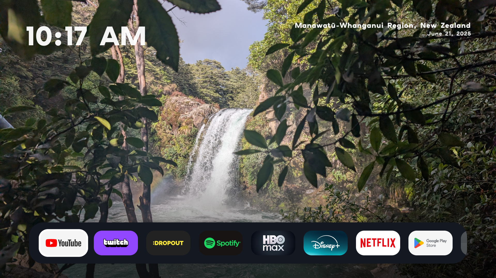

# TV Launcher — a custom Google TV / Android TV home screen

A minimal, **performance-first** launcher for Android TV / Google TV, built with
Kotlin and Jetpack Compose for TV. It replaces the busy stock launcher with a clean,
Mac-desktop-style home screen: your photos fill the screen as a slideshow wallpaper,
and your apps live in a floating dock along the bottom that scrolls like a belt.

It's designed to be **sideloaded** onto your own device, not published to a store.

---

## What it looks like



Full-screen photo wallpaper, the clock top-left, the photo's location and capture date
(from EXIF) top-right, and the floating app dock along the bottom.

**Features**

- **Photo-slideshow wallpaper** — full-screen crossfading photos (yours, bundled or
  served remotely). Crossfade pauses while you scroll the dock so it never hitches.
- **Floating dock** — a horizontally-scrolling belt of your installed apps. TV apps
  show their 16:9 banner; phone apps show a square icon. A soft-spring "pivot" keeps
  the focused tile centered and glides smoothly under rapid D-pad presses.
- **Clock** (top-left) and **photo place + date** (top-right, reverse-geocoded on-device
  from each photo's EXIF GPS / capture date).
- **Settings** — show/hide individual apps (hide the bloatware your TV shipped with),
  reorder the dock, and set the slideshow interval. Hidden apps are never even loaded,
  which keeps the launcher fast.
- **Screensaver** — a built-in `DreamService` that crossfades through the same photos.

Performance was the top priority: tiles use preloaded GPU-resident (`HARDWARE`) bitmaps,
the dock is a lightweight custom-drawn belt (not heavyweight Material cards), and the
whole scroll path was profiled with `dumpsys gfxinfo` to stay under the frame budget.

---

## Requirements

- **JDK 17** (Android Studio's bundled JBR works; it's actually JDK 21 and also fine).
- **Android SDK** with `platform-tools`, `platforms;android-34`, `build-tools;34.0.0`.
  Installing **Android Studio** is the easy way to get all of this; you can then build
  entirely from the command line if you prefer.
- An **Android TV / Google TV device** (or emulator). minSdk 26, targetSdk 34.
- **adb** — either on your `PATH`, or drop the platform-tools binaries into
  `./platform-tools/` (the helper scripts look there first, then fall back to `PATH`).

---

## Setup

1. Clone the repo.
2. Point Gradle at your SDK by creating `local.properties` in the project root
   (this file is git-ignored — never commit it):
   ```
   sdk.dir=/absolute/path/to/Android/Sdk
   ```
   On Windows the path is escaped, e.g.
   `sdk.dir=C\:\\Users\\you\\AppData\\Local\\Android\\Sdk`.
3. Add some photos (optional but recommended) — see
   [Adding screensaver / wallpaper photos](#adding-screensaver--wallpaper-photos).

---

## Build

```bash
# From the project root (use ./gradlew on macOS/Linux, .\gradlew.bat on Windows)
./gradlew assembleDebug
# → app/build/outputs/apk/debug/app-debug.apk
```

The debug build is signed with Gradle's auto-generated debug key by default. If you
want a **stable** debug signature (so `adb install -r` always updates in place across
machines), drop a keystore at `signing/debug.keystore` — the build uses it automatically
if present (see the comment in `app/build.gradle.kts` for the `keytool` command). The
`signing/` folder is git-ignored.

---

## Deploy to your TV

Android 11+ TVs use **Wireless debugging** (Settings → System → Developer options →
Wireless debugging). Ports are random and change when the setting is toggled.

```bash
# One-time pairing (use the "Pair device with pairing code" popup for the port + code):
adb pair <tv-ip>:<PAIRING_PORT>          # then enter the 6-digit code
# Connect (port shown on the main Wireless debugging screen):
adb connect <tv-ip>:<CONNECT_PORT>
adb devices
adb install -r app/build/outputs/apk/debug/app-debug.apk
```

Or use the convenience scripts (they locate adb and install the latest build):

- **Windows:** double-click `deploy.bat`, or run `.\deploy.ps1 <tv-ip>:<port>`
- The scripts use `./platform-tools/adb.exe` if present, otherwise `adb` from `PATH`.

Launch it directly:
```bash
adb shell am start -n com.nihar.tvlauncher/.MainActivity
```

---

## Adding screensaver / wallpaper photos

**Bundled (rebuild required):** drop `.jpg` / `.jpeg` / `.png` / `.webp` files into
`app/src/main/assets/screensaver/`, then rebuild and redeploy. These images are
git-ignored so your personal photos are never committed.

- Photos with EXIF **GPS** + **DateTimeOriginal** get a location + date overlay on the
  home screen (reverse-geocoded on-device; degrades gracefully if unavailable).

**Remote (no rebuild):** set `MANIFEST_URL` in
`app/src/main/java/com/nihar/tvlauncher/screensaver/ScreensaverConfig.kt` to an `https`
URL returning JSON — either `["https://host/a.jpg", ...]` or `{"images":[...]}` (a
GitHub raw file or any static host works). The app paints bundled photos instantly, then
swaps to the remote list once fetched, and caches the last list so it still works
offline. After that, changing photos is just editing the JSON + images at that URL.

**Test the screensaver immediately** (instead of waiting for idle):
```bash
# Select it first: Settings → System → Screensaver → this app's screensaver, then:
adb shell am start -n com.android.systemui/.Somnambulator
```

---

## Making it the default launcher

Google TV deliberately pins its own launcher and **hides the "default home app"
chooser**, so this is device-dependent and often not fully possible without trade-offs:

- The app registers as a home-screen candidate and can be granted the `HOME` role
  (Settings → *"Set as default launcher"* fires the system role dialog where available).
- On many Google TV boxes the **physical Home button is hardwired to Google's launcher**
  regardless of the home role. Community launchers (e.g.
  [FLauncher](https://gitlab.com/flauncher/flauncher), Projectivy) work around this by
  disabling the stock launcher via adb (`pm disable-user --user 0 <stock-launcher-pkg>`)
  and/or an accessibility service that watches for the stock launcher and relaunches
  itself over it. This app ships that service (`HomeRedirectService`); enable it from
  the in-app **Settings → "Set as default launcher"** button.

Some OEMs (e.g. TCL) run an **autostart manager** that blocks the accessibility service
from auto-binding at boot and resets that permission on every reboot. The service is put
in its own `:home` process so it survives the low-memory killer during normal use, but
after a **reboot** you may need to re-enable it: toggle the app's entry under
Accessibility off/on, or run `setup-home.ps1` / `setup-home.bat` from a PC (grants the
autostart appop and rebinds the service). See [`CLAUDE.md`](CLAUDE.md) for the full
diagnosis.

You can always open the launcher directly (`adb shell am start -n
com.nihar.tvlauncher/.MainActivity`) or from the app list, even if it isn't home.

---

## Project structure

```
app/src/main/
  AndroidManifest.xml                     HOME intent-filter + DreamService + <queries>
  java/com/nihar/tvlauncher/
    MainActivity.kt                       Hosts the Compose UI; launcher⇄settings nav
    LauncherScreen.kt                     Desktop UI: wallpaper slideshow + dock + overlays
    AppRepository.kt                      Queries launchable apps; preloads HARDWARE bitmaps
    AppEntry.kt                           App + settings-row data models
    LauncherPrefs.kt                      SharedPreferences: hidden set, order, interval
    PhotoExif.kt                          EXIF GPS→place + capture date for overlays
    SettingsScreen.kt                     Show/hide, reorder, slideshow interval
    Fonts.kt                              Bundled Elms Sans (OFL) for overlays
    LauncherTheme.kt                      Dark theme
    screensaver/
      ScreensaverDreamService.kt          System screensaver entry point
      SlideshowView.kt                    Crossfading photo slideshow (Views + Coil)
      ScreensaverConfig.kt                MANIFEST_URL + asset/cache constants
      ImageManifestRepository.kt          Remote JSON manifest → images, with cache
  res/font/elms_sans.ttf                  Overlay font (SIL OFL)
  assets/screensaver/                     Your bundled photos (git-ignored)
```

See [`CLAUDE.md`](CLAUDE.md) for deeper architecture notes, the scroll-performance
findings, and device-specific gotchas.

---

## Credits & licensing

- UI font: **Elms Sans** by Gida Type Studio, under the SIL Open Font License 1.1.
- Bundled screensaver photos are **not** included in this repository — add your own.

The application id / package is `com.nihar.tvlauncher`; rename it if you fork this for
your own build.
