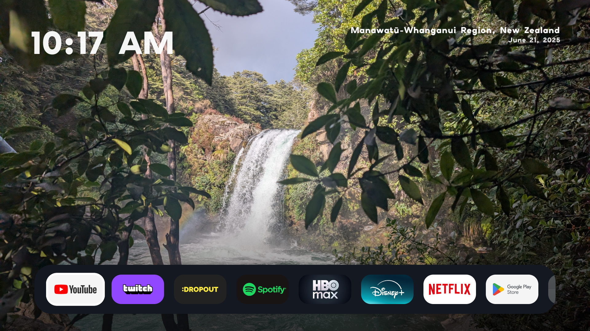

# TV Launcher — a custom Google TV / Android TV home screen

A minimal, **performance-first** launcher for Android TV / Google TV, built with
Kotlin and Jetpack Compose for TV. It replaces the busy stock launcher with a clean,
Mac-desktop-style home screen: your photos fill the screen as a slideshow wallpaper,
and your apps live in a floating dock along the bottom that scrolls like a belt.

It's designed to be **sideloaded** onto your own device, not published to a store.

---

## What it looks like



Full-screen photo wallpaper, the clock top-left, the photo's location and capture date
(from EXIF) top-right, and the floating app dock along the bottom.

**Features**

- **Photo-slideshow wallpaper** — full-screen crossfading photos (yours, bundled or
  served remotely). Crossfade pauses while you scroll the dock so it never hitches.
- **Floating dock** — a horizontally-scrolling belt of your installed apps. TV apps
  show their 16:9 banner; phone apps show a square icon. A soft-spring "pivot" keeps
  the focused tile centered and glides smoothly under rapid D-pad presses.
- **Clock** (top-left) and **photo place + date** (top-right, reverse-geocoded on-device
  from each photo's EXIF GPS / capture date).
- **Settings** — show/hide individual apps (hide the bloatware your TV shipped with),
  reorder the dock, and set the slideshow interval. Hidden apps are never even loaded,
  which keeps the launcher fast.
- **Screensaver** — a built-in `DreamService` that crossfades through the same photos.

Performance was the top priority: tiles use preloaded GPU-resident (`HARDWARE`) bitmaps,
the dock is a lightweight custom-drawn belt (not heavyweight Material cards), and the
whole scroll path was profiled with `dumpsys gfxinfo` to stay under the frame budget.

---

## Requirements

- **JDK 17** (Android Studio's bundled JBR works; it's actually JDK 21 and also fine).
- **Android SDK** with `platform-tools`, `platforms;android-34`, `build-tools;34.0.0`.
  Installing **Android Studio** is the easy way to get all of this; you can then build
  entirely from the command line if you prefer.
- An **Android TV / Google TV device** (or emulator). minSdk 26, targetSdk 34.
- **adb** — either on your `PATH`, or drop the platform-tools binaries into
  `./platform-tools/` (the helper scripts look there first, then fall back to `PATH`).

---

## Setup

1. Clone the repo.
2. Point Gradle at your SDK by creating `local.properties` in the project root
   (this file is git-ignored — never commit it):
   ```
   sdk.dir=/absolute/path/to/Android/Sdk
   ```
   On Windows the path is escaped, e.g.
   `sdk.dir=C\:\\Users\\you\\AppData\\Local\\Android\\Sdk`.
3. Photos need no setup — they stream from
   [the photo repo](https://github.com/rahinroy/photos). To use your own, see
   [Adding screensaver / wallpaper photos](#adding-screensaver--wallpaper-photos).

---

## Build

```bash
# From the project root (use ./gradlew on macOS/Linux, .\gradlew.bat on Windows)
./gradlew assembleDebug
# → app/build/outputs/apk/debug/app-debug.apk
```

The debug build is signed with Gradle's auto-generated debug key by default. If you
want a **stable** debug signature (so `adb install -r` always updates in place across
machines), drop a keystore at `signing/debug.keystore` — the build uses it automatically
if present (see the comment in `app/build.gradle.kts` for the `keytool` command). The
`signing/` folder is git-ignored.

---

## Deploy to your TV

Android 11+ TVs use **Wireless debugging** (Settings → System → Developer options →
Wireless debugging). Ports are random and change when the setting is toggled.

```bash
# One-time pairing (use the "Pair device with pairing code" popup for the port + code):
adb pair <tv-ip>:<PAIRING_PORT>          # then enter the 6-digit code
# Connect (port shown on the main Wireless debugging screen):
adb connect <tv-ip>:<CONNECT_PORT>
adb devices
adb install -r app/build/outputs/apk/debug/app-debug.apk
```

Or use the convenience scripts (they locate adb and install the latest build):

- **Windows:** double-click `deploy.bat`, or run `.\deploy.ps1 <tv-ip>:<port>`
- The scripts use `./platform-tools/adb.exe` if present, otherwise `adb` from `PATH`.

Launch it directly:
```bash
adb shell am start -n com.nihar.tvlauncher/.MainActivity
```

---

## Adding screensaver / wallpaper photos

Photos live in a **separate repo** and are fetched at runtime, so adding one never means
rebuilding or reinstalling the APK:

> **https://github.com/rahinroy/photos**

Drop `.jpg` / `.jpeg` / `.png` / `.webp` files into that repo's `photos/` folder and push
(or upload them through the GitHub web UI). A GitHub Action regenerates `screensaver.json`
— the manifest the TV reads — and commits it back. The launcher re-fetches on next start.
Deleting a photo works the same way.

`ScreensaverConfig.MANIFEST_URL` points at that manifest. Point it at your own fork, any
other `https` URL serving the same JSON, or blank it out to use bundled photos only.

**Manifest format.** A bare `["https://host/a.jpg", ...]` array works, but the generator
emits per-photo records so the overlay keeps working for remote images:

```json
{ "images": [
    { "url": "https://host/a.jpg", "lat": 36.6239, "lon": -121.9403,
      "taken": "2023-07-22T18:36:04" }
] }
```

`lat` / `lon` / `taken` come from each photo's EXIF and are optional. The TV
reverse-geocodes the coordinates **on-device** for the location + date overlay in the
top-right of the home screen — no lookup happens in the photo repo.

**Offline fallback (optional).** `ImageManifestRepository` resolves in this order:

    remote manifest  →  last-cached manifest (offline)  →  app/src/main/assets/screensaver/

The last successful manifest is cached to `filesDir`, so a TV that has fetched once keeps
working without network. Only put files in `app/src/main/assets/screensaver/` if you want
something to show on a device that has *never* reached the network — they inflate the APK
by their full size and need a rebuild to change. That folder is git-ignored, so personal
photos are never committed here either way.

**Test the screensaver immediately** (instead of waiting for idle):
```bash
# Select it first: Settings → System → Screensaver → this app's screensaver, then:
adb shell am start -n com.android.systemui/.Somnambulator
```

---

## Making it the default launcher

Google TV deliberately pins its own launcher and **hides the "default home app"
chooser**, so this is device-dependent and often not fully possible without trade-offs:

- The app registers as a home-screen candidate and can be granted the `HOME` role
  (Settings → *"Set as default launcher"* fires the system role dialog where available).
- On many Google TV boxes the **physical Home button is hardwired to Google's launcher**
  regardless of the home role. Community launchers (e.g.
  [FLauncher](https://gitlab.com/flauncher/flauncher), Projectivy) work around this by
  disabling the stock launcher via adb (`pm disable-user --user 0 <stock-launcher-pkg>`)
  and/or an accessibility service that watches for the stock launcher and relaunches
  itself over it. This app ships that service (`HomeRedirectService`); enable it from
  the in-app **Settings → "Set as default launcher"** button.

Some OEMs (e.g. TCL) run an **autostart manager** that blocks the accessibility service
from auto-binding at boot and resets that permission on every reboot. The service is put
in its own `:home` process so it survives the low-memory killer during normal use, but
after a **reboot** you may need to re-enable it: toggle the app's entry under
Accessibility off/on, or run `setup-home.ps1` / `setup-home.bat` from a PC (grants the
autostart appop and rebinds the service). See [`CLAUDE.md`](CLAUDE.md) for the full
diagnosis.

You can always open the launcher directly (`adb shell am start -n
com.nihar.tvlauncher/.MainActivity`) or from the app list, even if it isn't home.

---

## Project structure

```
app/src/main/
  AndroidManifest.xml                     HOME intent-filter + DreamService + <queries>
  java/com/nihar/tvlauncher/
    MainActivity.kt                       Hosts the Compose UI; launcher⇄settings nav
    LauncherScreen.kt                     Desktop UI: wallpaper slideshow + dock + overlays
    AppRepository.kt                      Queries launchable apps; preloads HARDWARE bitmaps
    AppEntry.kt                           App + settings-row data models
    LauncherPrefs.kt                      SharedPreferences: hidden set, order, interval
    PhotoExif.kt                          EXIF GPS→place + capture date for overlays
    SettingsScreen.kt                     Show/hide, reorder, slideshow interval
    Fonts.kt                              Bundled Elms Sans (OFL) for overlays
    LauncherTheme.kt                      Dark theme
    screensaver/
      ScreensaverDreamService.kt          System screensaver entry point
      SlideshowView.kt                    Crossfading photo slideshow (Views + Coil)
      ScreensaverConfig.kt                MANIFEST_URL + asset/cache constants
      ImageManifestRepository.kt          Remote JSON manifest → images, with cache
  res/font/elms_sans.ttf                  Overlay font (SIL OFL)
  assets/screensaver/                     Optional offline-fallback photos (git-ignored)
```

See [`CLAUDE.md`](CLAUDE.md) for deeper architecture notes, the scroll-performance
findings, and device-specific gotchas.

---

## Credits & licensing

- UI font: **Elms Sans** by Gida Type Studio, under the SIL Open Font License 1.1.
- Screensaver photos are **not** in this repository — they are served from a separate
  photo repo at runtime. Point `MANIFEST_URL` at your own.

The application id / package is `com.nihar.tvlauncher`; rename it if you fork this for
your own build.
